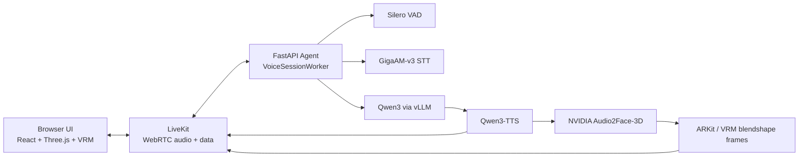

# Rula

**Closed-loop realtime Russian voice avatar demo.** Rula is a local-first digital human runtime for private, on-prem, air-gapped voice-agent experiments. It listens to speech, transcribes Russian locally, answers with a local LLM, speaks with local TTS, and drives a 3D VRM avatar through audio-based facial animation.

Rula is built for **local AI avatar**, **closed-loop digital human**, **Russian voice agent**, **offline AI assistant**, **realtime STT/LLM/TTS**, and **private on-prem avatar runtime** experiments on a Windows + WSL2 + NVIDIA GPU workstation.

> Status: demo / early runtime. The stack is not production-ready until the legal, latency, GPU, soak, and air-gap gates pass on the target host.

## What It Does

- Runs a local Russian conversational AI avatar.
- Targets closed-loop / offline deployments without cloud inference.
- Streams microphone audio through LiveKit/WebRTC.
- Uses local STT, LLM, TTS, VAD, and face-animation models.
- Renders a browser-based VRM avatar with Three.js for the demo surface.
- Keeps model weights, generated media, logs, databases, and secrets out of Git.
- Preserves realtime turn state with stale-generation dropping for interruption and barge-in.

## Closed-Loop Design

Rula is designed as a **closed-contour digital human runtime**. The browser UI is only the demo client, not the product boundary.

The intended deployment model is:

```text
local microphone / client
 -> local LiveKit media path
 -> local FastAPI voice runtime
 -> local STT / LLM / TTS / face-animation models
 -> local avatar or video output
```

Core principles:

- No OpenAI, cloud STT, cloud TTS, or hosted avatar inference in the default runtime.
- Internet is required only to download model artifacts and upstream dependencies.
- Model weights live under `models/hf/` and stay outside Git.
- Runtime state, logs, sqlite databases, generated media, and deployment secrets stay local.
- Browser rendering can be replaced by another client, native shell, kiosk app, Unreal/Unity scene, or future video-avatar renderer.
- Air-gap checks are part of acceptance, not an afterthought.

## Architecture



Current visual layer:

```text
TTS audio -> Audio2Face-3D -> blendshape envelopes -> Three.js VRM avatar
```

This is not a 2D talking-head video generator. The current avatar is a **3D VRM character** animated by facial blendshapes. A future realistic video avatar can replace this visual layer with:

```text
TTS audio -> audio-to-video model -> video frames -> WebRTC video track
```

## Agent Brain

The agent brain is a small deterministic dialogue runtime around a local LLM. It is not an agent-framework demo and it does not let the LLM own the realtime loop.

Core files:

- `apps/agent/src/ru_local_avatar_agent/voice/brain.py` - dialogue state, intent routing, prompt composition, response planning.
- `apps/agent/src/ru_local_avatar_agent/voice/worker.py` - realtime session worker: mic, VAD, STT, turn policy, LLM stream, TTS, A2F, LiveKit.
- `apps/agent/src/ru_local_avatar_agent/runtime/vllm_client.py` - streaming client for the local vLLM OpenAI-compatible endpoint.

Brain flow:

```text
transcribed user turn
 -> ConversationBrain
 -> IntentRouter
 -> StateReducer
 -> ResponsePlanner
 -> direct response or Qwen3 LLM stream
 -> clause chunker
 -> Qwen3-TTS
 -> Audio2Face / avatar output
```

Responsibilities:

- `ConversationState` keeps session-local dialogue state: avatar name, rejected names, recent turns, pending questions, interrupted assistant text, and open thread.
- `IntentRouter` catches latency-critical intents before the LLM: identity questions, memory recall, name negotiation, compound questions, continuation, ownership correction, and challenge responses.
- `StateReducer` records user turns, assistant final turns, and interrupted assistant turns.
- `PromptComposer` builds the Russian voice-system prompt and injects compact session context.
- `ResponsePlanner` chooses between a direct deterministic answer and a normal Qwen3 LLM response.
- `VoiceSessionWorker` owns media timing, interruption, barge-in, stale-generation dropping, TTS pacing, and avatar side-channel events.

Design rule:

```text
LLM generates normal dialogue text.
Runtime owns state, timing, cancellation, safety boundaries, and media.
```

That split is what makes the local voice agent usable in a realtime closed-loop environment: the model can be creative, but it cannot corrupt session state, replay stale audio, ignore an interrupt, or block the media path.

## Architectural Highlights

Rula is intentionally shaped as a realtime systems project, not a thin wrapper around model calls.

- **Modular monolith core:** the agent keeps domain state, voice runtime, API, metrics, and model adapters in one deployable process boundary until real scale pressure appears.
- **Explicit turn state machine:** `SessionStateMachine` is the source of truth for `turn_id`, `generation_id`, `branch_state`, interrupts, speculative branches, and stale artifact rejection.
- **Shared wire protocol:** Python emits `StreamEnvelope`; TypeScript consumes the same envelope shape through `packages/avatar_protocol`, so the browser and agent agree on session, turn, generation, sequence, and PTS fields.
- **Speculative turn-taking:** `TurnPolicy` can start speculative generation after a short silence window, then either commit it on EOT or discard it if the user resumes.
- **Two-phase barge-in:** playback first ducks quickly, then STT verifies whether the voiced burst is a real user interruption or just echo/click/noise before fully cancelling the response.
- **Audio-first hot path:** `AudioPacer` owns the continuous 20 ms LiveKit audio stream. Face frames, metrics, traces, and data-channel sends stay off the audio critical path to prevent mid-word stutter.
- **Bounded playback release:** turn state is not blocked forever by LiveKit playout; audio wait budgets are bounded and stale queues are cleared on timeout.
- **Clause-level streaming:** Qwen3 text is chunked into speakable clauses, so TTS can start before the full LLM response finishes.
- **Local TTS unit cache:** short deterministic/repeated TTS units are cached as JSON + NumPy arrays, not pickle, and are keyed by voice, generation config, and normalized text.
- **Parallel face animation:** Audio2Face runs from the TTS chunks in parallel with playback and emits batched blendshape frames over the data channel.
- **Client-side face anchoring:** the browser anchors `pts_ms` to the moment audio is actually heard using an audio energy onset detector, reducing audio-face drift caused by network jitter.
- **Fallback visemes:** if neural A2F frames are late or too weak, the client can synthesize Russian viseme frames from the spoken text as a visual fallback.
- **Mobile echo safety:** on mobile/touch devices, the microphone can be gated while the avatar speaks to reduce playback echo loops.
- **Fail-closed readiness:** `/ready` only reports voice-avatar readiness when artifacts, vLLM, GPU headroom, LiveKit credentials/server, and loaded voice engines are all healthy.
- **Session limits and TTL:** the API has bounded session lifetime and configurable active voice-session limits for production mode.
- **Conversation audit trail:** voice turns, state snapshots, interruptions, and trace summaries can be persisted to local SQLite for debugging and evals.
- **Prometheus metrics:** latency histograms and counters are aligned with acceptance gates: first audio, EOT, barge-in, LLM first token, TTS first chunk, A2F windows, stale drops, underruns, and pipeline errors.

## Realtime API Surface

The API is deliberately small:

| Endpoint | Purpose |
|---|---|
| `GET /health` | Process liveness. |
| `GET /ready` | Fail-closed product readiness for the voice avatar path. |
| `GET /api/runtime/status` | Artifact, service, GPU, LiveKit, vLLM, and voice-engine status. |
| `GET /metrics` | Prometheus metrics. |
| `POST /api/sessions` | Create a LiveKit-backed avatar session. |
| `POST /api/chat/text` | Text fallback path through local Qwen/vLLM. |
| `POST /api/admin/sessions/{session_id}/cancel` | Interrupt/cancel a session generation. |
| `GET /api/admin/sessions/{session_id}/conversation` | Local conversation audit events. |
| `GET /api/admin/sessions/{session_id}/turns` | Per-turn latency and reliability traces. |
| `GET /api/acceptance` | Configured acceptance thresholds. |

## Client Runtime

The browser client is a demo surface, but it is not a dumb canvas:

- LiveKit handles bidirectional media and the `avatar-protocol` data channel.
- `VoiceClient` drops stale generations, reconnect residue, and old room events.
- `FaceScheduler` interpolates A2F frames at render time and decays mouth pose on interrupt.
- `VrmAvatarStage` adds procedural idle life: blinking, gaze wander, breathing, nods, pointer attention, and responsive camera presets.
- `MobileEchoSafeMicGate` reduces mobile echo by disabling the mic while the avatar speaks and releasing it after the avatar returns to idle/listening.

## Model Stack

| Layer | Model / runtime | Used for | Source |
|---|---|---|---|
| LLM | `Qwen/Qwen3-14B-FP8` | Local dialogue model served by vLLM | [Hugging Face](https://huggingface.co/Qwen/Qwen3-14B-FP8) |
| LLM fallback | `Qwen/Qwen3-14B` | Optional non-FP8 fallback | [Hugging Face](https://huggingface.co/Qwen/Qwen3-14B) |
| TTS | `Qwen/Qwen3-TTS-12Hz-1.7B-CustomVoice` | Russian speech synthesis / avatar voice | [Hugging Face](https://huggingface.co/Qwen/Qwen3-TTS-12Hz-1.7B-CustomVoice) |
| STT | `ai-sage/GigaAM-v3` | Russian speech recognition | [Hugging Face](https://huggingface.co/ai-sage/GigaAM-v3), [GitHub](https://github.com/salute-developers/GigaAM) |
| Face animation | `nvidia/Audio2Face-3D-v3.0` | Audio-driven 3D facial animation | [Hugging Face](https://huggingface.co/nvidia/Audio2Face-3D-v3.0), [NVIDIA NGC](https://catalog.ngc.nvidia.com/orgs/nim/teams/nvidia/containers/audio2face-3d) |
| VAD | `silero-vad` | Voice activity detection / turn-taking | [GitHub](https://github.com/snakers4/silero-vad) |
| Avatar | Alicia Solid VRM 0.51 | Default replaceable VRM avatar | [UniVRM asset](https://github.com/vrm-c/UniVRM/blob/master/Tests/Models/Alicia_vrm-0.51/AliciaSolid_vrm-0.51.vrm) |
| Realtime transport | LiveKit | WebRTC audio/data room | [LiveKit](https://github.com/livekit/livekit), [Docs](https://docs.livekit.io/intro/overview/) |
| LLM serving | vLLM OpenAI-compatible server | Local `/v1` LLM API | [vLLM docs](https://docs.vllm.ai/en/stable/serving/openai_compatible_server/) |
| VRM rendering | `@pixiv/three-vrm` + Three.js | Browser-side VRM runtime | [three-vrm](https://github.com/pixiv/three-vrm) |

Model artifacts are downloaded into `models/hf/` and are intentionally ignored by Git.

## Tech Stack

- **Backend:** Python 3.11, FastAPI, Pydantic, Uvicorn.
- **Voice runtime:** in-process STT/TTS/A2F workers, LiveKit Python SDK, ONNX Runtime GPU.
- **LLM serving:** vLLM with an OpenAI-compatible local endpoint.
- **Frontend:** React, TypeScript, Vite, Three.js, `@pixiv/three-vrm`, LiveKit client.
- **Runtime host:** Windows project checkout, WSL2/Docker GPU runtime, NVIDIA CUDA.
- **Observability:** Prometheus and Grafana in the WSL compose stack.

## Requirements

Recommended target profile:

- Windows host with WSL2.
- NVIDIA GPU with CUDA support.
- RTX 5090-class profile in `profiles/rtx5090.yaml`.
- 64 GB RAM minimum, 128 GB recommended.
- Docker Desktop with GPU support.
- Hugging Face token for gated or throttled model downloads.

## Quick Start

Clone the repo:

```powershell
git clone https://github.com/ykshv/rula.git
cd rula
```

Save a Hugging Face token locally:

```powershell
powershell -ExecutionPolicy Bypass -File .\scripts\secrets\set_hf_token.ps1
```

Download model artifacts:

```powershell
powershell -ExecutionPolicy Bypass -File .\scripts\models\download_all.ps1
```

Download the default VRM avatar:

```powershell
powershell -ExecutionPolicy Bypass -File .\scripts\assets\download_default_avatar.ps1
```

Start the local development shell:

```powershell
powershell -ExecutionPolicy Bypass -File .\scripts\dev\start_local.ps1
```

Open:

```text
http://127.0.0.1:46174/
```

Stop:

```powershell
powershell -ExecutionPolicy Bypass -File .\scripts\dev\stop_local.ps1
```

## WSL / Docker Runtime

From WSL:

```bash
cd /mnt/<drive>/path/to/rula/infra/wsl
cp .env.example .env
docker compose up --build
```

Default endpoints:

| Service | URL |
|---|---|
| Web UI | `http://127.0.0.1:46174/` |
| Agent API | `http://127.0.0.1:46181/health` |
| vLLM | `http://127.0.0.1:46111/v1/models` |
| LiveKit | `http://127.0.0.1:46280/` |
| Prometheus | `http://127.0.0.1:46909/` |
| Grafana | `http://127.0.0.1:46300/` |

## Configuration

Main local config files:

- `.env.local.example` - copy or use the secret setup script; never commit `.env.local`.
- `infra/wsl/.env.example` - Docker/WSL compose defaults.
- `profiles/rtx5090.yaml` - model, latency, GPU, TTS, turn-taking, and avatar profile.
- `models/manifests/default_avatar.alicia_solid_vrm_0_51.json` - default avatar source, checksum, license metadata.

The project uses a local OpenAI-compatible endpoint only because vLLM exposes that API shape. It does not require OpenAI cloud inference for the default runtime.

## Observability And Eval Loop

The runtime is designed to prove behavior with local evidence:

- `/metrics` exposes Prometheus-compatible latency and reliability metrics.
- `TurnTrace` records phase timing from user speech end to speculation, EOT, first LLM token, first TTS chunk, first audio, and audio completion.
- `SQLiteConversationAuditStore` persists local conversation events and state snapshots for session debugging.
- `scripts/evals/e2e_probe.py` acts as a headless LiveKit participant and measures first audio, barge-in, speculative hit rate, and data-channel envelopes.
- `scripts/evals/voice_smoke.py` validates STT, TTS, A2F, and VAD components.
- `scripts/evals/soak_test.py`, `latency_report.py`, `gpu_smoke.py`, and `legal_gate.py` define the release evidence path.

## Repository Layout

```text
apps/agent/                  FastAPI agent and realtime voice runtime
apps/web/                    React + Three.js + VRM browser UI
packages/avatar_protocol/    Typed event/data-channel protocol
profiles/                    Hardware/runtime profiles
models/manifests/            Versioned model/avatar manifests only
scripts/models/              Model download and verification scripts
scripts/evals/               GPU, latency, legal, and soak checks
infra/wsl/                   Local WSL/Docker runtime
```

## Runtime Contracts

Every hot-path event or chunk carries:

```text
session_id, turn_id, generation_id, branch_state, seq, pts_ms?
```

When the user interrupts, `generation_id` advances. Any stale audio, text, face frame, or avatar event from an older generation must be dropped silently. This is the core invariant that keeps realtime playback, barge-in, and avatar animation coherent.

## What Is Still Missing

This repository is intentionally framed as a demo / early runtime. The architecture is set up for a serious closed-loop avatar system, but these pieces are still required before calling it production-grade:

- Current legal evidence for every model, asset, container image, and redistribution path.
- Full 60-minute / 120+ turn soak evidence on the target machine.
- Verified air-gap run where the full conversation works with outbound network blocked.
- Clean release manifest for model/container checksums.
- Hardened production auth and admin access around any endpoint exposed outside localhost.
- Stronger browser/client security headers if the demo UI is exposed outside localhost.
- Better visual layer if the goal is a photorealistic human instead of a VRM avatar.
- Real tool-calling layer with explicit schemas, permission policy, timeouts, and audit trail.
- Durable long-term memory or local RAG with privacy boundaries and evals.
- Stronger behavioral evals for the agent brain: persona drift, memory accuracy, interruption recovery, and repeated-turn robustness.
- Dedicated visual behavior planner for gaze, idle motion, emotion, gesture, and future video-avatar state.
- External exposure hardening: auth on admin endpoints, rate limits, stricter CORS/Host policy, and production OpenAPI/docs policy.
- Proper release packaging for a closed contour: pinned container images, offline dependency mirror, model license bundle, and reproducible install instructions.
- CI gates for Python tests, TypeScript build, protocol tests, lint, and secret scanning.
- Operational runbooks for GPU OOM, LiveKit failures, vLLM failures, TTS stalls, and corrupted model cache.
- Clear project license and explicit third-party attribution bundle.

## Quality Targets

| Gate | Target |
|---|---|
| First audio p50 | 600-700 ms after user speech end |
| First audio p95 | <= 1100 ms |
| Avatar visible reaction | <= 250 ms |
| Barge-in p95 | <= 300 ms |
| Russian ASR WER | <= 8% |
| Speculative hit rate | >= 70% |
| Audio-face PTS drift | <= 50 ms p95 |
| Reliability | 60-minute or 120+ turn soak test |

Run acceptance checks before calling any deployment production-ready:

```powershell
python .\scripts\evals\legal_gate.py
python .\scripts\evals\gpu_smoke.py
python .\scripts\evals\latency_report.py
python .\scripts\evals\soak_test.py
powershell -ExecutionPolicy Bypass -File .\scripts\airgap\check_windows_firewall.ps1
```

From WSL:

```bash
cd /mnt/<drive>/path/to/rula
bash scripts/airgap/check_wsl_network.sh
```

## Security And Privacy

- Do not commit `.env.local`, `infra/wsl/.env`, tokens, keys, certificates, sqlite databases, logs, generated audio/video, or model weights.
- Hugging Face tokens are stored locally through `scripts/secrets/set_hf_token.ps1`.
- `models/hf/`, `runtime/`, `data/`, `node_modules/`, generated avatars, and model binaries are ignored by Git.
- Default examples use local development secrets only; replace them before any public deployment.
- Voice cloning, realistic avatars, and redistribution require explicit consent and license review.

## Legal Notes

Third-party models and assets keep their own licenses and terms. Before production use or redistribution, run the legal gate and verify:

- Qwen3 / Qwen3-TTS license and terms.
- GigaAM license and Russian ASR usage constraints.
- NVIDIA Audio2Face-3D Open Model License terms.
- Alicia Solid / UniVRM MIT attribution.
- Any custom voice, face, or avatar consent.

## Suggested GitHub Metadata

Description:

```text
Local realtime Russian voice avatar demo with STT, LLM, TTS, Audio2Face, LiveKit, and VRM rendering.
```

Topics:

```text
local-ai, digital-human, realtime-avatar, voice-agent, russian-ai, russian-asr,
stt, tts, llm, vrm, audio2face, livekit, fastapi, threejs, qwen, vllm
```

## License

Project license: TBD.

Model weights, third-party assets, and external runtimes are governed by their upstream licenses.
