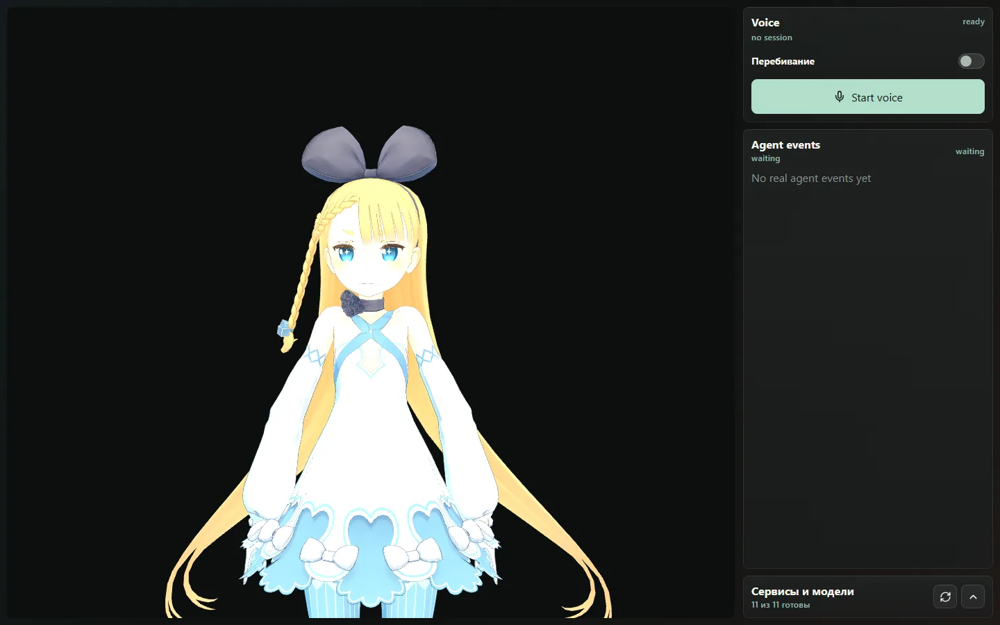
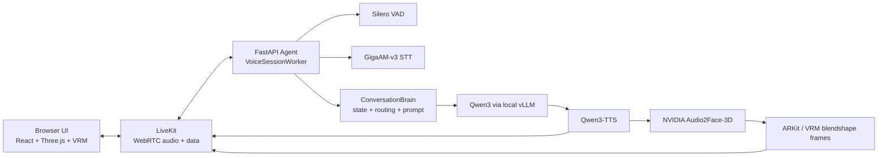

# Rula

**Local-first realtime Russian voice avatar.** Rula is an open-source demo runtime for a private digital human that listens to Russian speech, transcribes it locally, answers with a local Qwen LLM, speaks with local TTS, and drives a browser VRM avatar through audio-based facial animation.

[](LICENSE)
[](https://ai.igor-ya.ru/)
[](https://igor-ya.ru/posts/on-prem-voice-agents/)
[](#closed-contour-runtime)



> Status: demo / early runtime. Rula is not production-ready until the legal, latency, GPU, soak, and air-gap gates pass on the target host.
>
> Live browser preview: [ai.igor-ya.ru](https://ai.igor-ya.ru/). The preview exposes the browser demo surface; the target voice runtime is designed for local / on-prem inference.
>
> Architecture article: [Голосовой агент on-prem: закрытый контур и полсекунды](https://igor-ya.ru/posts/on-prem-voice-agents/).

## What It Is

Rula is a **closed-contour digital human runtime** for local AI avatar experiments on a Windows + WSL2 + NVIDIA GPU workstation.

It combines:

- Russian STT, local LLM, local TTS, VAD, and facial animation.
- LiveKit/WebRTC media transport.
- FastAPI voice-agent backend.
- React + Three.js + VRM browser demo client.
- Realtime turn state, interruption handling, stale-generation dropping, metrics, and eval scripts.

The current visual layer is a **3D VRM avatar**, not a photorealistic 2D talking-head generator. A future video-avatar renderer can replace the visual layer while keeping the same realtime voice contracts.

## Why It Matters

Voice-avatar demos break when conversation becomes real: late answers, old audio after interruption, echo mistaken for barge-in, mouth drift, and one GPU carrying STT, LLM, TTS, and face animation at the same time.

Rula treats those as systems problems. The project is built around measurable realtime contracts: first audio latency, barge-in latency, speculative turn-taking, stale artifact rejection, audio-face sync, GPU readiness, and air-gap acceptance.

## Closed-Contour Runtime

The browser is only the demo client. The product boundary is the local runtime.

```text
microphone / local client
 -> local LiveKit media path
 -> local FastAPI voice runtime
 -> local STT / LLM / TTS / face-animation models
 -> local avatar or video output
```

Default runtime principles:

- No OpenAI, cloud STT, cloud TTS, or hosted avatar inference in the default path.
- Internet is required only to download model artifacts and upstream dependencies.
- Model weights live under `models/hf/` and are ignored by Git.
- Runtime state, logs, SQLite databases, generated media, and deployment secrets stay local.
- Browser rendering can be replaced by a kiosk app, native shell, Unreal/Unity scene, or video-avatar renderer.
- Air-gap checks are part of acceptance, not a documentation afterthought.

## Architecture



Current visual path:

```text
TTS audio -> Audio2Face-3D -> blendshape envelopes -> Three.js VRM avatar
```

Future realistic-video path:

```text
TTS audio -> audio-to-video model -> video frames -> WebRTC video track
```

## Engineering Highlights

Rula is intentionally shaped as a realtime systems project, not a thin wrapper around model calls.

- **Modular monolith core:** domain state, API, media runtime, metrics, and model adapters stay in one deployable boundary until measured scale pressure appears.
- **Explicit turn state machine:** `SessionStateMachine` owns `turn_id`, `generation_id`, `branch_state`, interrupts, speculative branches, and stale artifact rejection.
- **Shared wire protocol:** Python emits `StreamEnvelope`; TypeScript consumes the same event shape from `packages/avatar_protocol`.
- **Speculative turn-taking:** `TurnPolicy` can start early generation after a silence window and discard it if the user resumes speaking.
- **Two-phase barge-in:** playback ducks quickly, then STT verifies whether the burst is a real interruption or echo/noise.
- **Audio-first hot path:** `AudioPacer` owns the continuous 20 ms LiveKit audio stream; face frames and metrics stay off the critical path.
- **Clause-level streaming:** Qwen text is chunked into speakable clauses so TTS can start before the full answer is complete.
- **Client-side face anchoring:** the browser anchors `pts_ms` to the moment audio is actually heard, reducing mouth drift under jitter.
- **Fail-closed readiness:** `/ready` reports voice-avatar readiness only when artifacts, local services, GPU headroom, LiveKit, and voice engines are healthy.

## Agent Brain

The agent brain is a deterministic dialogue runtime around a local LLM. The LLM generates dialogue text; the runtime owns state, timing, cancellation, media, and safety boundaries.

```text
transcribed user turn
 -> ConversationBrain
 -> IntentRouter
 -> StateReducer
 -> ResponsePlanner
 -> direct response or Qwen3 LLM stream
 -> clause chunker
 -> Qwen3-TTS
 -> Audio2Face / avatar output
```

The brain keeps session-local memory, routes latency-critical intents before the LLM, composes a compact Russian voice prompt, emits direct deterministic answers when useful, and drops stale `generation_id` data at every hop.

## Model Stack

| Layer | Model / runtime | Used for | Source |
|---|---|---|---|
| LLM | `Qwen/Qwen3-14B-FP8` | Local dialogue model served by vLLM | [Hugging Face](https://huggingface.co/Qwen/Qwen3-14B-FP8) |
| LLM fallback | `Qwen/Qwen3-14B` | Optional non-FP8 fallback | [Hugging Face](https://huggingface.co/Qwen/Qwen3-14B) |
| TTS | `Qwen/Qwen3-TTS-12Hz-1.7B-CustomVoice` | Russian speech synthesis / avatar voice | [Hugging Face](https://huggingface.co/Qwen/Qwen3-TTS-12Hz-1.7B-CustomVoice) |
| STT | `ai-sage/GigaAM-v3` | Russian speech recognition | [Hugging Face](https://huggingface.co/ai-sage/GigaAM-v3), [GitHub](https://github.com/salute-developers/GigaAM) |
| Face animation | `nvidia/Audio2Face-3D-v3.0` | Audio-driven 3D facial animation | [Hugging Face](https://huggingface.co/nvidia/Audio2Face-3D-v3.0), [NVIDIA NGC](https://catalog.ngc.nvidia.com/orgs/nim/teams/nvidia/containers/audio2face-3d) |
| VAD | `silero-vad` | Voice activity detection / turn-taking | [GitHub](https://github.com/snakers4/silero-vad) |
| Avatar | Alicia Solid VRM 0.51 | Default replaceable VRM avatar | [UniVRM asset](https://github.com/vrm-c/UniVRM/blob/master/Tests/Models/Alicia_vrm-0.51/AliciaSolid_vrm-0.51.vrm) |
| Realtime transport | LiveKit | WebRTC audio/data room | [LiveKit](https://github.com/livekit/livekit), [Docs](https://docs.livekit.io/intro/overview/) |
| LLM serving | vLLM OpenAI-compatible server | Local `/v1` LLM API shape only | [vLLM docs](https://docs.vllm.ai/en/stable/serving/openai_compatible_server/) |
| VRM rendering | `@pixiv/three-vrm` + Three.js | Browser-side avatar runtime | [three-vrm](https://github.com/pixiv/three-vrm) |

The OpenAI-compatible API shape is local vLLM compatibility. The default runtime does not call OpenAI cloud inference.

## Tech Stack

- **Backend:** Python 3.11, FastAPI, Pydantic, Uvicorn.
- **Voice runtime:** in-process STT/TTS/A2F workers, LiveKit Python SDK, ONNX Runtime GPU.
- **LLM serving:** local vLLM server.
- **Frontend:** React, TypeScript, Vite, Three.js, `@pixiv/three-vrm`, LiveKit client.
- **Host profile:** Windows checkout, WSL2/Docker GPU runtime, NVIDIA CUDA.
- **Observability:** Prometheus and Grafana in the WSL compose stack.

## Quick Start

Recommended target: Windows + WSL2, NVIDIA CUDA GPU, Docker Desktop with GPU support, 64 GB RAM minimum, 128 GB recommended, and a Hugging Face token.

```powershell
git clone https://github.com/ykshv/rula.git
cd rula
powershell -ExecutionPolicy Bypass -File .\scripts\secrets\set_hf_token.ps1
powershell -ExecutionPolicy Bypass -File .\scripts\models\download_all.ps1
powershell -ExecutionPolicy Bypass -File .\scripts\assets\download_default_avatar.ps1
powershell -ExecutionPolicy Bypass -File .\scripts\dev\start_local.ps1
```

Open `http://127.0.0.1:46174/`.

Stop:

```powershell
powershell -ExecutionPolicy Bypass -File .\scripts\dev\stop_local.ps1
```

From WSL:

```bash
cd /mnt/<drive>/path/to/rula/infra/wsl
cp .env.example .env
docker compose up --build
```

Default local endpoints: Web UI `:46174`, Agent API `:46181`, vLLM `:46111`, LiveKit `:46280`, Prometheus `:46909`, Grafana `:46300`.

## Runtime Contracts

Every hot-path event or chunk carries:

```text
session_id, turn_id, generation_id, branch_state, seq, pts_ms?
```

When the user interrupts, `generation_id` advances. Any stale audio, text, face frame, or avatar event from an older generation must be dropped silently. This invariant keeps realtime playback, barge-in, and avatar animation coherent.

## API And Evals

Core endpoints: `GET /health`, `GET /ready`, `GET /api/runtime/status`, `GET /metrics`, `POST /api/sessions`, `POST /api/chat/text`, admin cancellation and conversation/turn trace endpoints, and `GET /api/acceptance`.

Local evidence path:

- `/metrics` exposes Prometheus-compatible latency and reliability metrics.
- `TurnTrace` records EOT, speculation, first LLM token, first TTS chunk, first audio, and audio completion.
- `SQLiteConversationAuditStore` persists local conversation events and state snapshots.
- `scripts/evals/e2e_probe.py` measures first audio, barge-in, speculative hit rate, and data-channel envelopes.
- `voice_smoke.py`, `gpu_smoke.py`, `latency_report.py`, `soak_test.py`, and `legal_gate.py` define release evidence.

## Quality Targets

| Gate | Target |
|---|---|
| First audio p50 | 600-700 ms after user speech end |
| First audio p95 | <= 1100 ms |
| Avatar visible reaction | <= 250 ms |
| Barge-in p95 | <= 300 ms |
| Russian ASR WER | <= 8% |
| Speculative hit rate | >= 70% |
| Audio-face PTS drift | <= 50 ms p95 |
| Reliability | 60-minute or 120+ turn soak test |

Run acceptance checks before calling any deployment production-ready:

```powershell
python .\scripts\evals\legal_gate.py
python .\scripts\evals\gpu_smoke.py
python .\scripts\evals\latency_report.py
python .\scripts\evals\soak_test.py
powershell -ExecutionPolicy Bypass -File .\scripts\airgap\check_windows_firewall.ps1
```

From WSL:

```bash
bash scripts/airgap/check_wsl_network.sh
```

## Repository Layout

```text
apps/agent/                  FastAPI agent and realtime voice runtime
apps/web/                    React + Three.js + VRM browser UI
packages/avatar_protocol/    Typed event/data-channel protocol
profiles/                    Hardware/runtime profiles
models/manifests/            Versioned model/avatar manifests only
scripts/models/              Model download and verification scripts
scripts/evals/               GPU, latency, legal, and soak checks
infra/wsl/                   Local WSL/Docker runtime
```

## What Is Still Missing

- Current legal evidence for every model, asset, container image, and redistribution path.
- Full 60-minute / 120+ turn soak evidence on the target machine.
- Verified air-gap run where the full conversation works with outbound network blocked.
- Release manifest for model and container checksums.
- Stronger browser/client security headers if the demo UI is exposed outside localhost.
- Photorealistic or video-avatar visual layer if the target is a realistic human clone.
- Tool-calling layer with explicit schemas, permission policy, timeouts, and audit trail.
- Durable long-term memory or local RAG with privacy boundaries and evals.
- Offline dependency mirror and reproducible closed-contour install bundle.
- Operational runbooks for GPU OOM, LiveKit failures, vLLM failures, TTS stalls, and corrupted model cache.
- Third-party attribution bundle for redistributed assets and model artifacts.

## Security, Legal, License

- Do not commit `.env.local`, `infra/wsl/.env`, tokens, keys, certificates, SQLite databases, logs, generated audio/video, or model weights.
- Hugging Face tokens are stored locally through `scripts/secrets/set_hf_token.ps1`.
- Voice cloning, realistic avatars, and redistribution require explicit consent and license review.
- Third-party models and assets keep their own licenses and terms.
- See [SECURITY.md](SECURITY.md) for vulnerability reporting and supported scope.

MIT License. The MIT license covers this repository's source code and documentation. Model weights, third-party assets, and external runtimes are governed by their upstream licenses.
